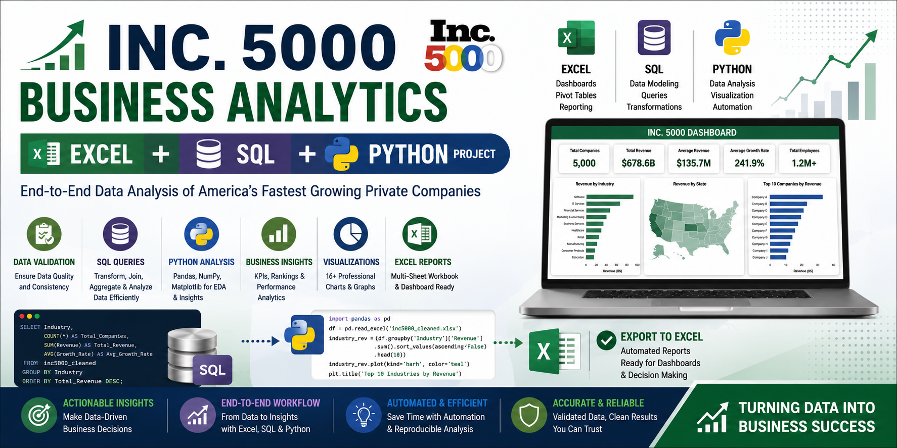

<p align="center">
  
</p>
# 📈 Inc. 5000 Business Analytics | Excel + Python


---

## 📌 Project Overview

This project analyzes the **Inc. 5000 Fastest Growing Private Companies** dataset using **Microsoft Excel** and **Python**.

The objective is to transform raw business data into meaningful insights through:

- Data Validation
- Exploratory Data Analysis (EDA)
- Business Performance Analysis
- Executive KPI Reporting
- Data Visualization
- Automated Excel Reporting

The project demonstrates an end-to-end analytics workflow commonly used by Data Analysts.

---

# 📂 Repository Structure

```text
inc5000-excel-python-analysis/
│
├── README.md
├── requirements.txt
│
├── data/
│   ├── raw/
│   │   └── inc5000_cleaned.xlsx
│   │
│   └── exports/
│       └── inc5000_analysis.xlsx
│
├── notebooks/
│   ├── 01_data_loading.ipynb
│   ├── 02_data_validation.ipynb
│   ├── 03_eda.ipynb
│   ├── 04_business_analysis.ipynb
│   ├── 05_visualizations.ipynb
│   └── 06_export_to_excel.ipynb
│
├── charts/
│
├── reports/
│   ├── business_questions.md
│   ├── data_dictionary.md
│   └── insights.md
│
└── excel_dashboard/
    └── Inc5000_Dashboard.xlsx
```

---

# 🎯 Project Objectives

- Analyze the Inc. 5000 dataset
- Validate data quality
- Perform exploratory data analysis
- Discover business trends
- Build executive KPIs
- Generate business insights
- Create professional visualizations
- Export analysis into Excel
- Build an interactive Excel dashboard

---

# 🛠 Tech Stack

| Tool | Purpose |
|------|----------|
| Excel | Dashboard & Pivot Tables |
| Python | Data Analysis |
| Pandas | Data Manipulation |
| NumPy | Numerical Operations |
| Matplotlib | Data Visualization |
| OpenPyXL | Excel Export |
| Jupyter Notebook | Analysis Environment |

---

# 📒 Project Workflow

```text
Clean Dataset
      │
      ▼
Data Loading
      │
      ▼
Data Validation
      │
      ▼
Exploratory Data Analysis
      │
      ▼
Business Analysis
      │
      ▼
Visualizations
      │
      ▼
Excel Export
      │
      ▼
Excel Dashboard
```

---

# 📊 Analysis Performed

## Data Validation

- Missing Values
- Duplicate Records
- Data Types
- Unique Values
- Outlier Detection
- Blank Values
- Numeric Validation
- Data Consistency

---

## Exploratory Data Analysis

- Dataset Overview
- Descriptive Statistics
- Revenue Analysis
- Employee Analysis
- Growth Analysis
- Industry Analysis
- State Analysis
- Correlation Analysis

---

## Business Analysis

- Executive KPIs
- Revenue Performance
- Industry Performance
- State Performance
- Metro Performance
- Revenue Efficiency
- Company Rankings
- Revenue Categories
- Growth Categories
- Employee Size Analysis
- Company Size Analysis

---

## Data Visualizations

The project includes multiple charts such as:

- Revenue Distribution
- Employee Distribution
- Growth Distribution
- Revenue by Industry
- Revenue by State
- Top Industries
- Top States
- Top Metro Areas
- Revenue Categories
- Growth Categories
- Company Size
- Employee Size Band
- Top Revenue Companies
- Revenue vs Employees
- Growth vs Revenue
- Correlation Heatmap

---

# 📁 Jupyter Notebooks

| Notebook | Description |
|-----------|-------------|
| 01_data_loading | Load and inspect dataset |
| 02_data_validation | Validate dataset quality |
| 03_eda | Exploratory Data Analysis |
| 04_business_analysis | Business KPI analysis |
| 05_visualizations | Business charts |
| 06_export_to_excel | Export reports to Excel |

---

# 📈 Executive KPIs

The project calculates KPIs including:

- Total Companies
- Total Revenue
- Average Revenue
- Median Revenue
- Maximum Revenue
- Minimum Revenue
- Total Employees
- Average Employees
- Average Growth Rate
- Number of Industries
- Number of States
- Number of Metro Areas

---

# 📦 Excel Export

The analysis is automatically exported into a multi-sheet workbook.

**Workbook includes:**

- Executive KPIs
- Dataset Summary
- Industry Summary
- State Summary
- Metro Summary
- Revenue Category
- Growth Category
- Company Size
- Employee Size
- Top Revenue Companies
- Top Growth Companies
- Revenue Efficiency
- Company Rankings

---

# 📊 Excel Dashboard

The interactive dashboard includes:

### KPI Cards

- Total Companies
- Total Revenue
- Average Revenue
- Average Growth
- Total Employees

### Charts

- Revenue by Industry
- Revenue by State
- Top Companies
- Revenue Categories
- Growth Categories
- Company Size
- Employee Size
- Top Metro Areas

### Interactive Filters

- Industry
- State
- Region
- Company Size
- Revenue Category
- Growth Category

---

# 📷 Sample Outputs

```
charts/

01_revenue_distribution.png

02_employee_distribution.png

03_growth_distribution.png

04_top_industries.png

05_top_states.png

06_revenue_by_industry.png

07_revenue_by_state.png

08_revenue_category.png

09_growth_category.png

10_company_size.png

11_employee_size_band.png

12_top_companies_revenue.png

13_revenue_vs_employees.png

14_growth_vs_revenue.png

15_correlation_heatmap.png

16_top_metro_areas.png
```

---

# 🚀 How to Run

## Clone Repository

```bash
git clone https://github.com/yourusername/inc5000-excel-python-analysis.git
```

---

## Install Dependencies

```bash
pip install -r requirements.txt
```

---

## Open Jupyter Notebook

```bash
jupyter notebook
```

---

## Run Notebooks

Execute the notebooks in order:

1. Data Loading
2. Data Validation
3. EDA
4. Business Analysis
5. Visualizations
6. Export to Excel

---

# 💼 Skills Demonstrated

- Data Cleaning
- Data Validation
- Exploratory Data Analysis
- Business Analysis
- KPI Development
- Data Visualization
- Dashboard Development
- Excel Automation
- Business Reporting
- Python Programming
- Pandas
- NumPy
- Matplotlib
- OpenPyXL

---

# 🎯 Learning Outcomes

Through this project, I practiced:

- Professional data analysis workflow
- Business KPI reporting
- Data storytelling
- Excel dashboard development
- Python automation
- Analytical thinking
- Business insight generation
- Report automation

---

# 📌 Future Improvements

- SQL integration
- Power BI dashboard
- Tableau dashboard
- Predictive analytics
- Machine Learning models
- Interactive web dashboard
- Automated report scheduling

---

# 👨‍💻 Author

**Kunal Yadav**

Aspiring Data Analyst passionate about turning data into actionable business insights using **Excel**, **Python**, **SQL**, **Power BI**, and **Tableau**.

---

## ⭐ If you found this project useful, consider giving it a star!
